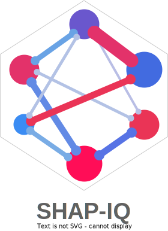
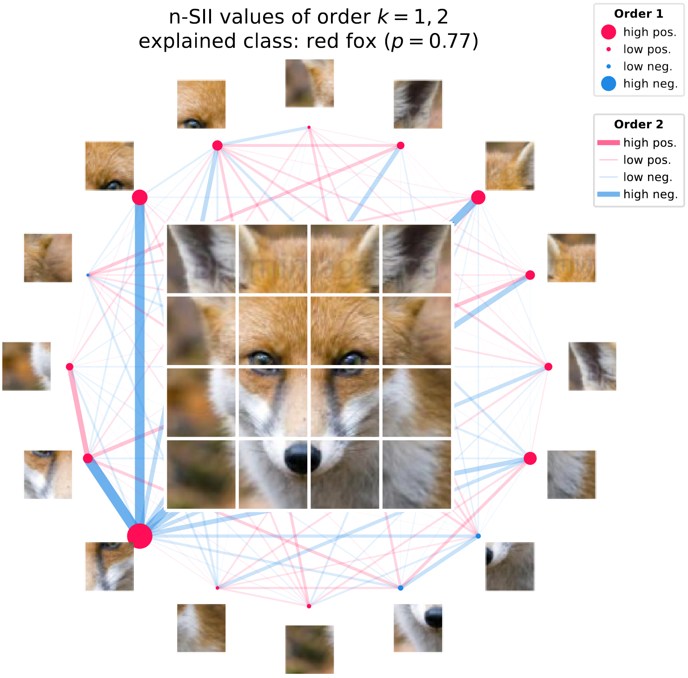

<p align="center">
  
</p>

<p align="center">
  <!-- Tests -->
  <a href="https://github.com/mmschlk/shapiq/actions/workflows/unit-tests.yml">
    
  </a>

  <!-- Coverage Test -->
  <a href='https://coveralls.io/github/mmschlk/shapiq?branch=main'>
    
  </a>

  <!-- Read the Docs -->
  <a href='https://shapiq.readthedocs.io/en/latest/?badge=latest'>
      
  </a>
  
  <!-- PyPI Version -->
  <a href="https://pypi.org/project/shapiq">
    
  </a>
  
  <!-- PyPI status -->
  <a href="https://pypi.org/project/shapiq">
    
      
  <!-- PePy -->
  <a href="https://pepy.tech/project/shapiq">
    
  </a>
      
  <!-- License -->
  <a href="https://opensource.org/licenses/MIT">
    
  </a>

  <!-- Codestyle -->
  <a href="https://github.com/psf/black">
    
  </a>
</p>


# SHAP-IQ: SHAP Interaction Quantification
> An interaction may speak more than a thousand main effects.

SHAP Interaction Quantification (short SHAP-IQ) is an **XAI framework** extending on the well-known [`shap`](https://github.com/shap/shap) explanations by introducing interactions to the equation.
Shapley interactions extend on indivdual Shapley values by quantifying the **synergy** effect between machine learning entities such as features, data points, or weak learners in ensemble models.
Synergies between these entities (also called players in game theory jargon) allows for a more intricate evaluation of your **black-box** models!

# 🛠️ Install
`shapiq` is intended to work with **Python 3.9 and above**. Installation can be done via `pip`:

```sh
pip install shapiq
```

# ⭐ Quickstart
You can use `shapiq` in different ways. If you have a trained model you can rely on the `shapiq.explainer` classes.
If you are interested in the underlying game theoretic algorithms, then check out the `shapiq.approximator` modules.
You can also plot and visualize your interaction scores with `shapiq.plot`.

## 📈 Compute k-SII values

Explain your models with Shapley interaction values like the k-SII values:

```python
# train a model
from sklearn.ensemble import RandomForestRegressor

model = RandomForestRegressor(n_estimators=50, random_state=42)
model.fit(x_train, y_train)

# explain with k-SII interaction scores
from shapiq import TabularExplainer

explainer = TabularExplainer(
    model=model.predict,
    background_data=x_train,
    index="k-SII",
    max_order=2
)
interaction_values = explainer.explain(x_explain, budget=2000)
print(interaction_values)

>> > InteractionValues(
     >> > index = k - SII, max_order = 2, min_order = 1, estimated = True, estimation_budget = 2000,
>> > values = {
              >> > (0,): -91.0403,  # main effect for feature 0
>> > (1,): 4.1264,  # main effect for feature 1
>> > (2,): -0.4724,  # main effect for feature 2
>> > ...
     >> > (0, 1): -0.8073,  # 2-way interaction for feature 0 and 1
>> > (0, 2): 2.469,  # 2-way interaction for feature 0 and 2
>> > ...
     >> > (10, 11): 0.4057  # 2-way interaction for feature 10 and 11
                    >> >}
>> > )
```

## 📊 Visualize your Interactions

One handy way of visualizing interaction scores (up to order 2) are network plots.
You can see an example of such a plot below.
The nodes represent **attribution** scores and the edges represent the **interactions**.
The strength and size of the nodes and edges are proportional to the absolute value of the
attribution scores and interaction scores, respectively.

```python
from shapiq.plot import network_plot

network_plot(
    first_order_values=k_sii_first_order,  # first order k-SII values
    second_order_values=k_sii_second_order # second order k-SII values
)
```

The pseudo-code above can produce the following plot (here also an image is added):

<p align="center">
  
</p>

## 📖 Documentation
The documentation for ``shapiq`` can be found [here](https://shapiq.readthedocs.io/en/latest/).

## 💬 Citation

If you **ejnoy** `shapiq` consider starring ⭐ the repository. If you **really enjoy** the package or it has been useful to you, and you would like to cite it in a scientific publication, please refer to the [paper](https://openreview.net/forum?id=IEMLNF4gK4) accepted at NeurIPS'23:

```bibtex
@article{shapiq,
  author       = {Fabian Fumagalli and
                  Maximilian Muschalik and
                  Patrick Kolpaczki and
                  Eyke H{\"{u}}llermeier and
                  Barbara Hammer},
  title        = {{SHAP-IQ:} Unified Approximation of any-order Shapley Interactions},
  journal      = {CoRR},
  volume       = {abs/2303.01179},
  year         = {2023},
  doi          = {10.48550/ARXIV.2303.01179},
  eprinttype    = {arXiv}
}
```
