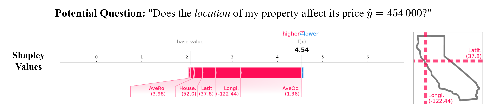
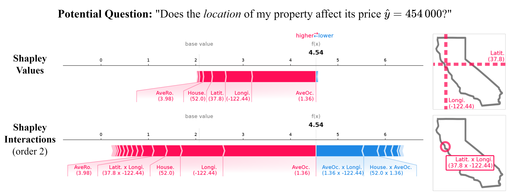
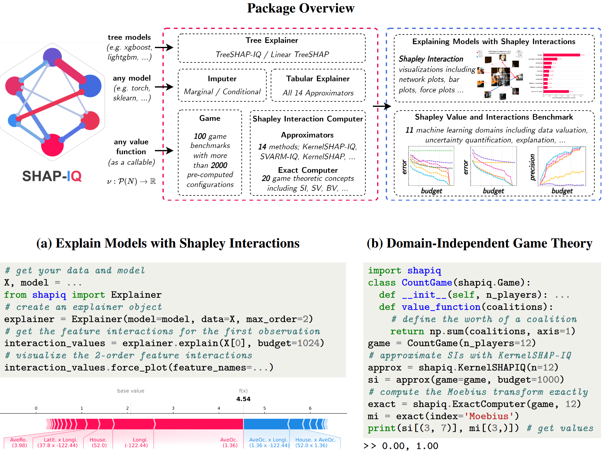

# What Are Shapley Interactions, and Why Should You Care?
Shapley values are the go-to method for explainable AI because they are easy to interpret and theoretically well-founded.
However, they struggle to capture the interplay between features.
About two years ago, we attended a talk that introduced the concept of **Shapley interactions**, and we quickly realized that Shapley interactions were exactly the solution to our problem!
Unfortunately, the presenter also mentioned that calculating Shapley interaction values is extremely difficult, if not impossible.
We started experimenting a bit and soon came up with a preliminary approach to compute Shapley interactions for any machine learning model.
After receiving positive feedback and growing interest from the community, we realized that this research gap was a perfect opportunity to pursue our own interests and create impact for others.
That’s when our shapiq project was born. Here, we want to tell you what Shapley interactions are and why you should care.

## What Are Interactions?

Imagine you're working with the California housing dataset and we want to predict house prices. Features like location, median income, and year built all play a role.
Location, for example, is represented by longitude (west-east) and latitude (north-south).
But here’s the twist: looking at longitude or latitude individually doesn’t tell the whole story. It’s their combination—pinpointing the exact location—that influences house prices.
Take two houses (with otherwise similar properties) near the ocean:
* Close to San Francisco: $454,000.
* Far from major hotspots: $210,000.

This difference isn’t explained by longitude or latitude alone but by their interaction. Interactions capture the idea that one feature's influence (longitude) depends on the value of another (latitude).

## Limitations of Shapley Values
Shapley values are popular because they distribute the effects of features fairly.
For example, if you explain the above-mentioned house in San Francisco with a predicted house price of 454,000$, Shapley values show that both longitude and latitude positively contribute (see image below).
But there's a problem: Shapley values merge individual effects and interaction effects into a single number. This means:
* We can’t tell how much of a feature’s influence is individual versus interactive.
* We don’t know which other features it interacts with.

## Enter Shapley Interactions
Shapley interactions enhance the traditional Shapley value approach by breaking down the effects of features into **individual contributions** and **interactions between features**.
Instead of providing a single value per feature, Shapley interactions distribute the prediction's influence across both individual features and groups of interacting features.
So for each combination of features we, potentially, can get a value of an interaction.
Let’s return to our **California housing** example, the decomposition up to order 2 compared to order 1 (Shapley value) shows that:
* Longitude has a high individual contribution, showing the importance of proximity to the ocean.
* Latitude, however, has little individual impact, with its contribution coming entirely from its interaction with longitude (in the image below latitude’s contribution vanishes but the interaction between longitude and latitude appears). This interaction captures how the combination of longitude and latitude identifies high-value locations, like San Francisco.

By predefining a **maximum interaction order**, you can control how detailed the analysis gets.
Setting it to second-order interactions, for instance, allows you to explore how pairs of features interact (like longitude and latitude) while still capturing individual effects.
This provides a richer understanding of how features influence predictions—whether independently or through their interplay.

Hence, Shapley interactions give you more granular insights into the relationships driving model predictions, helping **uncover synergies or redundancies that traditional Shapley values can’t**.
One of the main takeaways here is that we can interpret Shapley interactions like you are used to with SHAP, while providing more information. This level of detail, however, can come with a cost.

## Balancing Insights and Complexity
The more interactions we analyze (higher-order decompositions), the more insights we uncover.
**But there’s a tradeoff:** explanations become more complex and harder to interpret (because we have way more values/interactions to analyze).
Striking the right balance between depth and simplicity depends on your goals.

## Computing Shapley Interactions in Python with shapiq

If you're curious about how to compute these decompositions or visualize them, check out our shapiq package for an easy way to explore Shapley interactions and uncover new insights!
Currently, we offer a range of model-agnostic and model-specific explainers and computation methods, which you can use to calculate Shapley interactions and Shapley values for all data types and model kinds.
Check out the tutorial notebooks on how to use it for your task.

