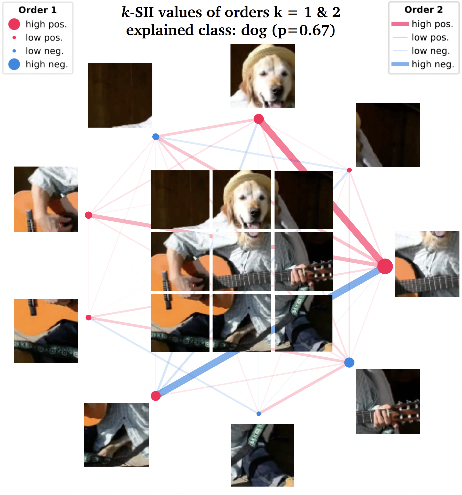

Getting Started
===============

Explain a model with Shapley interaction values, e.g. the k-SII values.

..  code-block:: python

    import shapiq
    # load data
    X, y = shapiq.load_california_housing(to_numpy=True)
    # train a model
    from sklearn.ensemble import RandomForestRegressor
    model = RandomForestRegressor()
    model.fit(X, y)
    # set up an explainer with k-SII interaction values up to order 4
    explainer = shapiq.TabularExplainer(
        model=model,
        data=X,
        index="k-SII",
        max_order=4
    )
    # explain the model's prediction for the first sample
    interaction_values = explainer.explain(X[0], budget=256)
    # analyse interaction values
    print(interaction_values)

    >> InteractionValues(
    >>     index=k-SII, max_order=4, min_order=0, estimated=False,
    >>     estimation_budget=256, n_players=8, baseline_value=2.07282292,
    >>     Top 10 interactions:
    >>         (0,): 1.696969079  # attribution of feature 0
    >>         (0, 5): 0.4847876
    >>         (0, 1): 0.4494288  # interaction between features 0 & 1
    >>         (0, 6): 0.4477677
    >>         (1, 5): 0.3750034
    >>         (4, 5): 0.3468325
    >>         (0, 3, 6): -0.320  # interaction between features 0 & 3 & 6
    >>         (2, 3, 6): -0.329
    >>         (0, 1, 5): -0.363
    >>         (6,): -0.56358890
    >> )

    # visualize interaction values
    shapiq.network_plot(
        first_order_values=interaction_values.get_n_order_values(1),
        second_order_values=interaction_values.get_n_order_values(2)
    )
    # or use
    interaction_values.plot_network()

The pseudo-code above can produce the following plot (here also an image is added):

