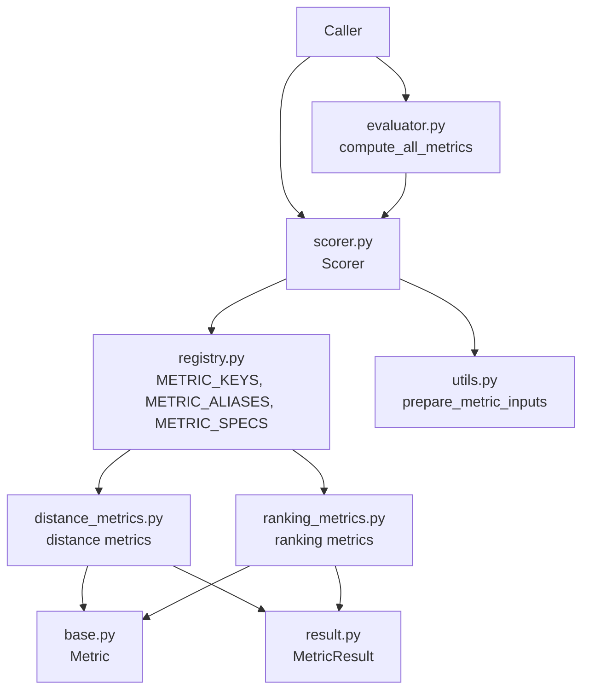
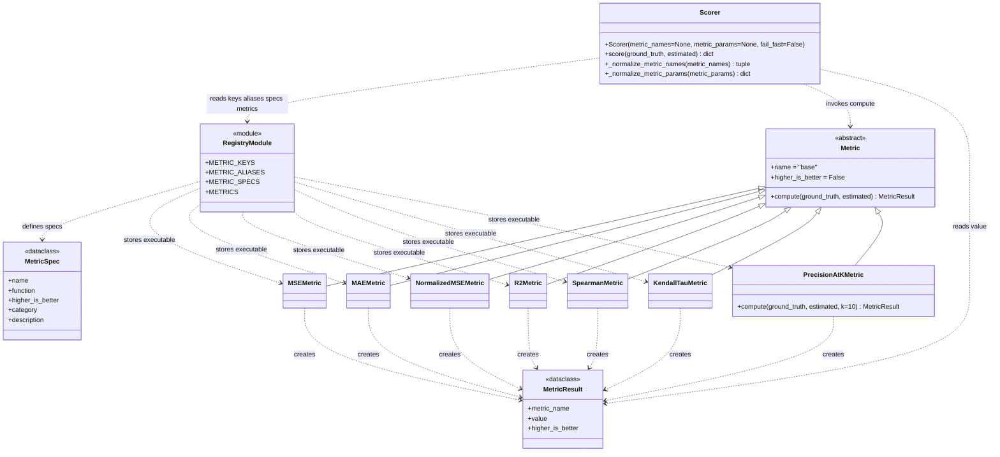
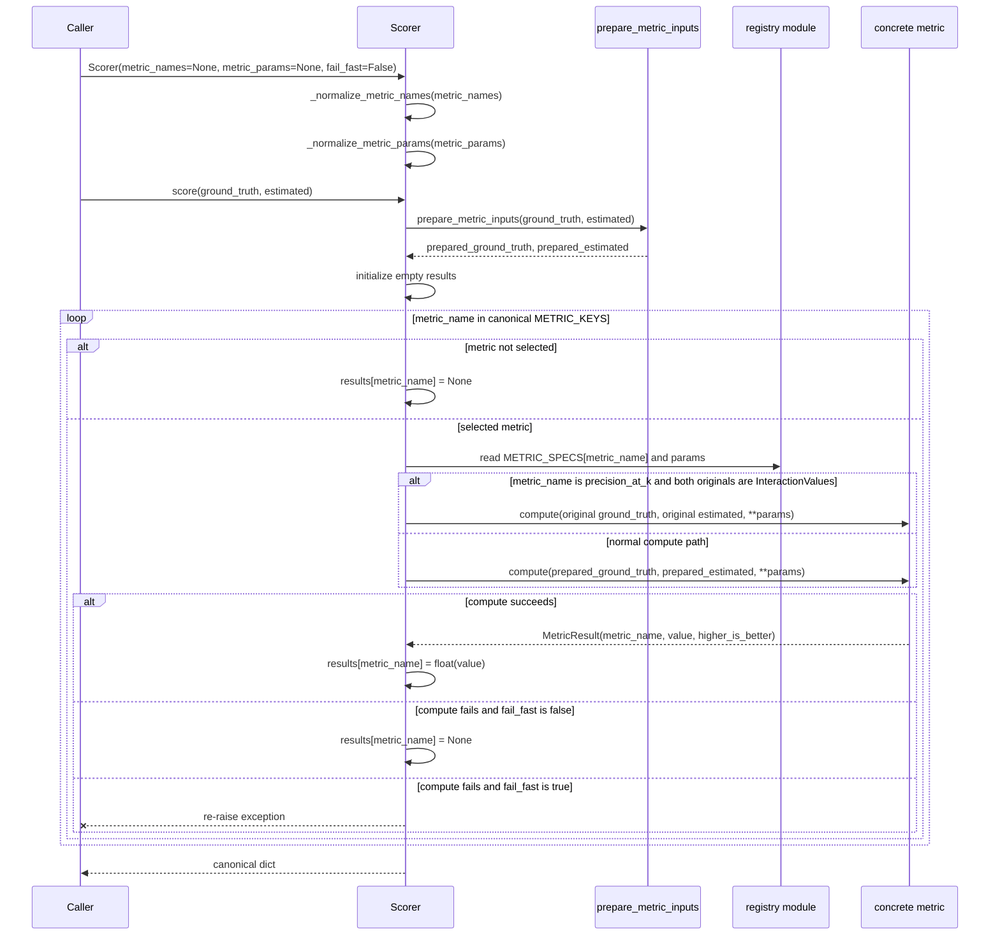
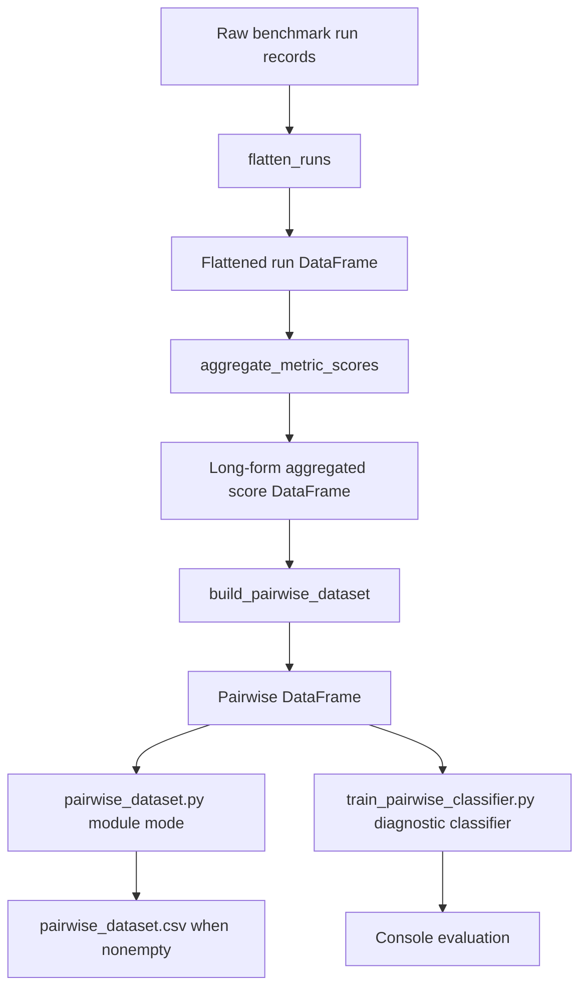

# Benchmark Metrics and PDL Sensitivity Analysis

This page documents the implemented metrics subsystem and a proposed Pairwise Difference Learning sensitivity analysis for the benchmark. It uses three evidence labels throughout:

* **Repository implementation evidence** means behavior present in the repository code or tests named here.
* **Literature evidence** means a claim supported by the cited papers.
* **Proposed benchmark-specific design** means a benchmark reporting protocol described here, not a completed production feature.

## Contribution Scope

This work focuses on the metrics subsystem and the Pairwise Difference Learning prototype for sensitivity analysis. The Elo scorer is an existing independently developed repository component and is not part of this contribution. It is mentioned only to distinguish global leaderboard scoring from context-dependent PDL sensitivity analysis.

## Metrics Overview

**Implemented. Repository implementation evidence.** The metrics subsystem is centered on `Metric`, `MetricResult`, and `MetricSpec`. The abstract metric API lives in `src/leaderboard/metrics/base.py`. Concrete metric classes live in `src/leaderboard/metrics/distance_metrics.py` and `src/leaderboard/metrics/ranking_metrics.py`. The registry in `src/leaderboard/metrics/registry.py` exposes `METRIC_KEYS`, `METRIC_SPECS`, and `METRICS`.

**Implemented. Repository implementation evidence.** The canonical metric keys are exactly:

* `mse`
* `mae`
* `mse_normalized`
* `r2`
* `spearman`
* `kendall_tau`
* `precision_at_k`

The input alias `normalized_mse` is accepted and maps to `mse_normalized`. It is not a separate canonical output key.

**Implemented. Repository implementation evidence.** `src/leaderboard/metrics/scorer.py` contains `Scorer.score`, which computes metric values for one run. `src/leaderboard/metrics/evaluator.py` contains `compute_all_metrics`, a wrapper for evaluating all registered metrics. `src/leaderboard/metrics/utils.py` contains `prepare_metric_inputs` and `_prepare_interaction_values`, which align inputs before metric computation.

**Implemented. Repository implementation evidence.** Tests in `tests/leaderboard/test_metrics.py` and `tests/leaderboard/test_ranking_metric.py` describe expected metric behavior, including `test_distance_metrics_parametrized_edge_values`, `test_r2_returns_nan_for_constant_ground_truth`, and `test_precision_at_k_uses_absolute_top_k_overlap`. Pairwise label-direction behavior is covered in `tests/leaderboard/test_pairwise_dataset.py` by `test_mse_lower_score_wins` and `test_spearman_higher_score_wins`.

## Metrics Package Structure

**Implemented. Repository implementation evidence.** The metrics package is split by contract, result transport, concrete metric families, registry metadata, input preparation, orchestration, and compatibility wrappers. The files below are the permitted metrics modules.

| File | Component type | Main responsibility | Why separate? | Imports | Used by |
| --- | --- | --- | --- | --- | --- |
| `__init__.py` | package API | Exports exactly `METRICS`, `METRIC_KEYS`, `METRIC_ALIASES`, `METRIC_SPECS`, and `Scorer` through `__all__`. `Metric`, `MetricResult`, concrete metric classes, and `compute_all_metrics` are not package-level exports. | Keeps the public package surface small while still exposing lookup metadata and the scorer. | `registry.METRICS`, `registry.METRIC_KEYS`, `registry.METRIC_ALIASES`, `registry.METRIC_SPECS`, `scorer.Scorer` | External imports and tests such as `test_public_api_exports_required_metrics` |
| `base.py` | abstract contract | Defines `Metric`, an ABC with class attributes `name = "base"` and `higher_is_better = False`. Its exact abstract method is `compute(self, ground_truth, estimated) -> MetricResult`, with two inputs only. | Gives every metric the same minimal compute contract without formula logic, input alignment, registry logic, or error policy. | `abc.ABC`, `abc.abstractmethod`, `MetricResult` | `distance_metrics.py`, `ranking_metrics.py` |
| `result.py` | result transport | Defines mutable `@dataclass` `MetricResult` with exactly `metric_name`, `value`, and `higher_is_better`. It carries values only and does no validation. | Lets metrics return a shared shape while `Scorer` can read `.value` and return a plain canonical dictionary. | `dataclasses.dataclass` | Concrete metrics and `Scorer.score` |
| `distance_metrics.py` | concrete distance metrics | Defines `MSEMetric`, `MAEMetric`, `NormalizedMSEMetric`, and `R2Metric`. MSE subtracts arrays and uses `np.mean(difference**2)`. MAE subtracts arrays and uses `np.mean(np.abs(...))`. Normalized MSE uses `np.var` and falls back to MSE when variance is zero. R2 converts with `np.array`, checks shapes explicitly, then uses squared sums, the mean, and `np.isclose` on the denominator. | Keeps value-distance formulas separate from rank or top-k semantics. These classes instantiate `MetricResult` and don't align common inputs. | `numpy`, `Metric`, `MetricResult` | `registry.py`, direct tests in `test_metrics.py` |
| `ranking_metrics.py` | concrete ranking metrics | Defines `SpearmanMetric`, `KendallTauMetric`, and `PrecisionAtKMetric`. Spearman and Kendall call SciPy `spearmanr` and `kendalltau` and map a NaN correlation to `0`. Precision@k compares absolute top-k membership, supports arrays and the original `InteractionValues` path, requires `k > 0`, checks shapes, and uses `_top_k_array_indices` and `_top_k_interaction_keys`. | Keeps ordering and membership metrics separate from numeric-distance metrics. `PrecisionAtKMetric` is the only concrete class with a narrower extra parameter, `k=10`. | `numpy`, `scipy.stats.kendalltau`, `scipy.stats.spearmanr`, `shapiq.InteractionValues`, `Metric`, `MetricResult` | `registry.py`, direct tests in `test_metrics.py` and `test_ranking_metric.py` |
| `registry.py` | registry module | Defines frozen dataclass `MetricSpec` with exactly `name`, `function`, `higher_is_better`, `category`, and `description`. Defines canonical ordered `METRIC_KEYS`, accepted external-to-canonical `METRIC_ALIASES`, canonical-to-spec `METRIC_SPECS`, and `METRICS`, which contains canonical executable objects plus alias keys. | Centralizes lookup, selection, canonical output order, alias handling, and direction reuse without conditional chains. | Concrete metric classes from `distance_metrics.py` and `ranking_metrics.py`, `dataclass` | `Scorer`, package API, pairwise code that reads metric direction, tests such as `test_registry_specs_match_public_metric_instances` |
| `utils.py` | input preparation functions | Defines `remove_empty_value_if_needed`, `prepare_metric_inputs`, `_prepare_interaction_values`, and `_values_for_interactions`. `remove_empty_value_if_needed` returns arrays unchanged. For `InteractionValues` with the `()` key, it deep copies and sets `interactions[()] = 0`. `prepare_metric_inputs` only special-cases when both inputs are `InteractionValues`; otherwise it calls `np.asarray(..., dtype=float)`, checks shape equality, and raises `ValueError` on mismatch. `_prepare_interaction_values` uses the sorted union of nonempty lookup keys ordered by `(len(key), key)`, and `_values_for_interactions` uses `0` for missing keys. | Isolates array coercion and the benchmark assumption for aligning two interaction-value objects. | `copy.deepcopy`, `numpy`, `shapiq.InteractionValues` | `Scorer.score`, direct tests such as `test_interaction_values_ignore_empty_key_and_align_union` |
| `scorer.py` | orchestration class | Defines `Scorer(metric_names=None, metric_params=None, fail_fast=False)`. Persistent attrs are `metric_names`, `metric_params`, and `fail_fast`. `_normalize_metric_names` expands `None` to all `METRIC_KEYS`, applies aliases, raises `KeyError` for unknown names, and de-dupes while preserving order. `_normalize_metric_params` applies aliases and raises `KeyError` for unknown metric names, but doesn't statically validate nested parameter dictionaries or target metric compatibility. `score` prepares shared inputs first, initializes empty results, iterates canonical `METRIC_KEYS`, returns `None` for unselected metrics, uses specs and params for selected metrics, keeps the original `InteractionValues` branch for Precision@k, catches all exceptions unless `fail_fast=True`, stores `float(value)`, and returns all canonical keys. | Keeps runtime control flow and failure policy out of formulas and metadata. It contains no metric formula. | `InteractionValues`, `METRIC_ALIASES`, `METRIC_KEYS`, `METRIC_SPECS`, `prepare_metric_inputs` | Callers that need configurable scoring, `evaluator.py`, tests such as `test_scorer_isolates_mocked_metric_failure` |
| `evaluator.py` | thin wrapper | Defines only `compute_all_metrics(ground_truth, estimated) -> Scorer().score(...)`. | Preserves convenience and compatibility for all-default scoring. New configurable selection should use `Scorer`; the wrapper always uses all defaults. | `Scorer` | Tests cover wrapper behavior. No repository caller beyond tests is claimed here. |

Concrete metric classes and `MetricSpec` duplicate name and direction values. Runtime discovery and direction lookup use registry specs, while metric instances carry result metadata in their returned `MetricResult`. The registry is authoritative for lookup and selection. The test `test_registry_specs_match_public_metric_instances` enforces consistency between public instances and specs.

## Architectural Rationale

**Implemented. Repository implementation evidence.** The architecture separates computation, transport, metadata, preparation, and runtime control flow.

| Concern | Component | What it owns | What it avoids |
| --- | --- | --- | --- |
| Abstract metric contract | `Metric` in `base.py` | A two-input `compute` method and default class metadata | Formula code, alignment, registry lookup, and failure policy |
| Result transport | `MetricResult` in `result.py` | `metric_name`, `value`, and `higher_is_better` | Validation and canonical dictionary shaping |
| Numeric distance computation | `distance_metrics.py` | MSE, MAE, normalized MSE, and R2 calculations | Ranking semantics and shared input preparation |
| Ranking and top-k computation | `ranking_metrics.py` | Spearman, Kendall Tau, and Precision@k calculations | Numeric distance semantics and global orchestration |
| Lookup and metadata | `registry.py` | Canonical keys, aliases, specs, executable objects, output order, and direction lookup | Formula execution and input preparation |
| Input preparation | `utils.py` | Array coercion, shape checks, and two-`InteractionValues` union alignment | Metric selection and failure handling |
| Runtime orchestration | `Scorer` in `scorer.py` | Metric selection, parameter dispatch, failure policy, Precision@k raw-object branch, and canonical dict output | Formula implementation |
| Compatibility wrapper | `compute_all_metrics` in `evaluator.py` | All-default scoring through `Scorer().score(...)` | Configurable metric selection |

This split has practical advantages. Adding a metric puts formula code in the distance or ranking module that matches its semantics. The registry gives callers one canonical output order and accepted aliases. `Scorer` can provide configurable selection, alias normalization, and fail-fast behavior without every metric duplicating that control flow. `MetricResult` stays as a small handoff object, so callers receive a plain dictionary rather than metric class instances.

The verified costs are also explicit. Instance and spec direction/name values are duplicated and must stay consistent. Adding a metric requires multiple synchronized changes. Precision@k's original-`InteractionValues` path weakens the pure array abstraction. Aliases and canonical keys can drift. Nested metric-parameter dictionaries aren't statically checked for compatibility with their target metric. Mapping correlation NaN values to `0` loses undefinedness. When both inputs are `InteractionValues`, the alignment uses a sorted union and fills missing keys with zero, which is a benchmark assumption rather than proof that the two explanations are semantically compatible.



## Metric Class and Runtime Structure

**Implemented. Repository implementation evidence.** The class relationships are intentionally small. `Metric` is an ABC, not a Protocol. It doesn't accept base `**params`; concrete classes may narrow their own compute signatures, and only `PrecisionAtKMetric` exposes `k=10`.



## Scoring Sequence

**Implemented. Repository implementation evidence.** `Scorer.score` returns a dictionary with every canonical key, in canonical order. The normal path prepares shared inputs once, then computes only selected metrics. Unselected metrics become `None`. With `fail_fast=False`, selected metric failures also become `None`. With `fail_fast=True`, the selected metric exception is re-raised.



## Array and InteractionValues Alignment

**Implemented. Repository implementation evidence.** `prepare_metric_inputs` coerces array-like values to floating point arrays and requires the ground truth and estimate arrays to have the same shape. This behavior applies after preparation for non-Precision@k metrics.

**Implemented. Repository implementation evidence.** `_prepare_interaction_values` aligns two `InteractionValues` objects over the sorted union of nonempty interaction keys, ordered by `(len(key), key)`. Missing keys are zero-filled. `remove_empty_value_if_needed` returns arrays unchanged; for an `InteractionValues` object with the `()` key, it deep copies the object and sets `interactions[()] = 0`.

**Implemented. Repository implementation evidence.** `Scorer.score` forwards the original `InteractionValues` objects only to `PrecisionAtKMetric`. It sends prepared arrays to the other metrics. This page doesn't claim behavior for mixed array and `InteractionValues` inputs beyond the code path above.

## End-to-End Metric Execution Example

**Implemented. Repository implementation evidence.** This example uses configurable scoring:

```python
scorer = Scorer(
    metric_names=["normalized_mse", "spearman"],
    metric_params={},
    fail_fast=False,
)
results = scorer.score(ground_truth, estimated)
```

The constructor maps the alias `normalized_mse` to canonical `mse_normalized`, keeps `spearman`, and de-dupes selected names while preserving order. During `score`, shared inputs are prepared first. For array-like inputs, both values are converted with `np.asarray(..., dtype=float)` and must have equal shape. The scorer then iterates all seven canonical keys: `mse`, `mae`, `mse_normalized`, `r2`, `spearman`, `kendall_tau`, and `precision_at_k`.

Only the selected specs and objects run. The scorer reads the `MetricSpec` and parameters for `mse_normalized`, invokes `NormalizedMSEMetric.compute`, receives a `MetricResult`, and stores `float(result.value)`. It repeats that path for `spearman` with `SpearmanMetric.compute`. The other canonical keys are present with `None` values because they weren't selected.

An illustrative final dictionary shape is:

```python
{
    "mse": None,
    "mae": None,
    "mse_normalized": "<computed>",
    "r2": None,
    "spearman": "<computed>",
    "kendall_tau": None,
    "precision_at_k": None,
}
```

The strings above stand in for computed floats. Real `Scorer.score` output stores floats or `None`.

## Component-Level API Reference

| Component | Type | Defined in | Purpose | Inputs | Outputs | Called by | Calls | Failure behavior | Tests |
| --- | --- | --- | --- | --- | --- | --- | --- | --- | --- |
| `Metric` | ABC | `base.py` | Defines the minimal metric contract and default class metadata. | `ground_truth`, `estimated` | `MetricResult` from subclasses | Concrete metric classes | None | Abstract method must be implemented by subclasses. | `test_registry_specs_match_public_metric_instances` |
| `MetricResult` | Mutable dataclass | `result.py` | Transports one metric result. | `metric_name`, `value`, `higher_is_better` | Object with the same fields | Concrete metrics, `Scorer.score` | None | No validation. | `test_distance_metrics_parametrized_edge_values`, `test_ranking_metrics_parametrized_ordering_and_constant_inputs` |
| `MetricSpec` | Frozen dataclass | `registry.py` | Stores registry metadata and executable function for one canonical metric. | `name`, `function`, `higher_is_better`, `category`, `description` | Spec object | `Scorer`, pairwise direction code | None | Dataclass construction errors if required fields are missing. | `test_registry_specs_match_public_metric_instances` |
| `MSEMetric` | Concrete metric | `distance_metrics.py` | Computes mean squared error. | Prepared arrays | `MetricResult` | `registry.py`, direct tests | NumPy subtraction and mean | NumPy errors can propagate to caller or be caught by `Scorer.score`. | `test_distance_metrics_parametrized_edge_values` |
| `MAEMetric` | Concrete metric | `distance_metrics.py` | Computes mean absolute error. | Prepared arrays | `MetricResult` | `registry.py`, direct tests | NumPy subtraction, absolute value, and mean | NumPy errors can propagate to caller or be caught by `Scorer.score`. | `test_distance_metrics_parametrized_edge_values` |
| `NormalizedMSEMetric` | Concrete metric | `distance_metrics.py` | Computes MSE normalized by ground-truth variance, with zero-variance fallback to MSE. | Prepared arrays | `MetricResult` | `registry.py`, direct tests | NumPy variance and mean | NumPy errors can propagate to caller or be caught by `Scorer.score`. | `test_distance_metrics_parametrized_edge_values` |
| `R2Metric` | Concrete metric | `distance_metrics.py` | Computes R2 faithfulness with explicit shape checking and constant-target handling. | Prepared arrays | `MetricResult` | `registry.py`, direct tests | NumPy arrays, means, squared sums, and `np.isclose` | Raises `ValueError` on shape mismatch; returns NaN for constant ground truth. | `test_r2_returns_nan_for_constant_ground_truth`, `test_r2_shape_mismatch_raises_clear_error` |
| `SpearmanMetric` | Concrete metric | `ranking_metrics.py` | Computes Spearman rank correlation and maps NaN correlation to `0`. | Prepared arrays | `MetricResult` | `registry.py`, direct tests | SciPy `spearmanr` | SciPy or input errors can propagate to caller or be caught by `Scorer.score`. | `test_ranking_metrics_parametrized_ordering_and_constant_inputs` |
| `KendallTauMetric` | Concrete metric | `ranking_metrics.py` | Computes Kendall Tau rank correlation and maps NaN correlation to `0`. | Prepared arrays | `MetricResult` | `registry.py`, direct tests | SciPy `kendalltau` | SciPy or input errors can propagate to caller or be caught by `Scorer.score`. | `test_ranking_metrics_parametrized_ordering_and_constant_inputs` |
| `PrecisionAtKMetric` | Concrete metric | `ranking_metrics.py` | Computes absolute top-k overlap for arrays or original `InteractionValues`. | Arrays or original `InteractionValues`, optional `k=10` | `MetricResult` | `registry.py`, `Scorer.score`, direct tests | `_top_k_array_indices`, `_top_k_interaction_keys` | Raises `ValueError` for `k <= 0` and shape mismatch; caps `k` at array size; empty arrays return `0`. | `test_precision_at_k_rejects_non_positive_k`, `test_precision_at_k_caps_k_at_array_size`, `test_precision_at_k_returns_zero_for_empty_arrays`, `test_precision_at_k_ignores_empty_interaction_values_key` |
| `prepare_metric_inputs` | Function | `utils.py` | Prepares shared inputs for scorer-controlled metric execution. | `ground_truth`, `estimated` | Two aligned arrays | `Scorer.score` | `_prepare_interaction_values` only when both inputs are `InteractionValues`; otherwise `np.asarray(..., dtype=float)` | Raises `ValueError` for shape mismatch in the array path. | `test_interaction_values_ignore_empty_key_and_align_union` |
| `_prepare_interaction_values` | Function | `utils.py` | Builds aligned arrays over the sorted union of nonempty interaction keys. | Two `InteractionValues` objects | Two arrays | `prepare_metric_inputs` | `_values_for_interactions` | Missing keys are filled with `0`; empty key is excluded. | `test_interaction_values_ignore_empty_key_and_align_union` |
| `Scorer` | Class | `scorer.py` | Stores normalized metric selection, parameter mapping, and failure policy. | `metric_names=None`, `metric_params=None`, `fail_fast=False` | Scorer instance | Callers and `compute_all_metrics` | `_normalize_metric_names`, `_normalize_metric_params` | Raises `KeyError` for unknown metric names or parameter keys. | `test_scorer_isolates_mocked_metric_failure` |
| `Scorer.score` | Method | `scorer.py` | Prepares inputs, dispatches selected metrics, handles failures, and returns canonical results. | `ground_truth`, `estimated` | Dict with all canonical metric keys and float or `None` values | Callers and `compute_all_metrics` | `prepare_metric_inputs`, registry specs, concrete metric compute methods | With `fail_fast=False`, selected metric exceptions become `None`; with `fail_fast=True`, exceptions are re-raised. | `test_scorer_isolates_mocked_metric_failure`, `test_public_api_exports_required_metrics` |
| `compute_all_metrics` | Function | `evaluator.py` | Convenience wrapper for all default metrics. | `ground_truth`, `estimated` | Result of `Scorer().score(...)` | Tests and any compatibility callers | `Scorer().score(...)` | Same behavior as default `Scorer.score`. | `test_public_api_exports_required_metrics` |

## Adding a Metric

**Repository implementation guidance.** Add a new metric based on what it measures. Use `distance_metrics.py` for numeric distance or faithfulness values. Use `ranking_metrics.py` for ordering or membership values. There is no generic extension module in the current package.

1. Subclass `Metric` in the appropriate module.
2. Set the constructor or class metadata to the metric name and direction used by its `MetricResult`.
3. Implement `compute(self, ground_truth, estimated) -> MetricResult` for the base contract. If the metric needs a narrower extra parameter, follow the current Precision@k pattern and make `Scorer` dispatch that parameter through `metric_params`.
4. Return `MetricResult(metric_name=..., value=..., higher_is_better=...)`. Don't put canonical dictionary logic inside the metric.
5. Import the class in `registry.py`.
6. Add a `MetricSpec` entry with `name`, executable `function`, `higher_is_better`, `category`, and `description`.
7. Manually add the canonical key to `METRIC_KEYS`; it doesn't auto-update from `METRIC_SPECS`.
8. Add an optional alias in `METRIC_ALIASES` if an external name should map to the canonical key.
9. Let `METRICS` derive executable objects from the canonical specs and alias keys.
10. Expand the package public API only if the project intentionally wants the new symbol exported. The existing package exports registry structures and `Scorer`, not concrete classes.
11. If the metric needs raw `InteractionValues` rather than prepared arrays, add an explicit `Scorer.score` special case like the current Precision@k branch.
12. Add tests for distance or ranking behavior, edge cases, `Scorer` dispatch, registry consistency, and public API expectations. Add pairwise direction tests only if pairwise behavior is touched.

Checklist for a new metric:

| Step | Required change | Why |
| --- | --- | --- |
| Choose module | `distance_metrics.py` or `ranking_metrics.py` | Keeps formula semantics grouped with existing metrics. |
| Implement class | Subclass `Metric`, set name/direction, return `MetricResult` | Satisfies the base contract and result transport. |
| Register spec | Import class and add a `MetricSpec` | Makes lookup and metadata available to `Scorer`. |
| Update keys | Add the canonical key to `METRIC_KEYS` manually | Controls output order and default scoring. |
| Add alias if needed | Update `METRIC_ALIASES` | Accepts external names without changing canonical output. |
| Handle parameters | Pass values through `metric_params` and update dispatch only when needed | Keeps formulas out of `Scorer` while allowing parameterized metrics. |
| Handle raw objects if needed | Add a targeted `Scorer.score` branch | Prepared arrays are the default path; raw `InteractionValues` require an explicit exception. |
| Test behavior | Cover the metric family, edge cases, `Scorer`, registry consistency, and package API | Prevents drift across formulas, metadata, aliases, and canonical outputs. |

## Metrics Architecture Limitations

**Implemented. Repository implementation evidence.** The current metrics architecture has known verified limits:

* Alignment for two `InteractionValues` inputs uses a sorted union and zero fill. It doesn't establish semantic compatibility between explanations.
* Mixed array and `InteractionValues` inputs aren't special-cased beyond the current `prepare_metric_inputs` behavior.
* Metric instance name/direction and registry spec name/direction are duplicated.
* Nested metric parameters aren't statically checked against the target metric signature.
* Precision@k has a special raw-`InteractionValues` path in `Scorer.score`, so not every metric receives only prepared arrays.
* Undefined Spearman or Kendall correlations are returned as `0`, which loses the distinction between undefined and zero correlation.
* Adding, removing, or renaming a metric requires synchronized registry changes across keys, specs, optional aliases, and tests.

## Canonical Metrics

### Mean Squared Error, `mse`

**Implemented. Repository implementation evidence.** `MSEMetric` computes mean squared error.

Formula:

```text
mse = mean((ground_truth - estimated)^2)
```

Intuition: MSE measures average squared deviation from the reference values. Lower is better, which is covered by `test_mse_lower_score_wins`.

Strengths: MSE is sensitive to large errors and is useful when large deviations should count more than small ones.

Weaknesses: Squaring makes the value scale-dependent and outlier-sensitive. A single large miss can dominate the score.

Edge cases: Exact agreement returns `0`. Inputs must align as arrays with the same shape after preparation, or as aligned `InteractionValues` arrays when both inputs are `InteractionValues`.

### Mean Absolute Error, `mae`

**Implemented. Repository implementation evidence.** `MAEMetric` computes mean absolute error.

Formula:

```text
mae = mean(abs(ground_truth - estimated))
```

Intuition: MAE measures the average absolute deviation from the reference values. Lower is better.

Strengths: MAE has the same units as the values being compared and weights errors linearly.

Weaknesses: MAE is still scale-dependent. It does not emphasize large errors as strongly as MSE.

Edge cases: Exact agreement returns `0`. Shape and alignment behavior follows `prepare_metric_inputs` and `_prepare_interaction_values`.

### Normalized Mean Squared Error, `mse_normalized`

**Implemented. Repository implementation evidence.** `NormalizedMSEMetric` computes MSE divided by the reference variance. The accepted input alias `normalized_mse` maps to the canonical key `mse_normalized`.

Formula:

```text
mse_normalized = mean((ground_truth - estimated)^2) / variance(ground_truth)
```

Intuition: normalized MSE compares squared error with the spread of the reference values. Lower is better.

Strengths: It reduces raw scale effects when reference variance is meaningful.

Weaknesses: It can be unstable when reference variance is very small. It also inherits MSE sensitivity to large deviations.

Edge cases: If the reference variance is zero, the implementation falls back to unnormalized MSE because no reference variance exists for normalization. This edge behavior is covered by distance metric tests such as `test_distance_metrics_parametrized_edge_values`.

### R2 Faithfulness, `r2`

**Implemented. Repository implementation evidence.** `R2Metric` computes a reconstruction quality score. It is a faithfulness or reconstruction metric, not a pure distance metric.

Formula:

```text
r2 = 1 - sum((ground_truth - estimated)^2) / sum((ground_truth - mean(ground_truth))^2)
```

Intuition: `1` means exact reconstruction. `0` matches the mean-reference baseline. Values below `0` are worse than that mean baseline. Higher is better.

Strengths: R2 gives a baseline-relative view of reconstruction quality, so it can show whether an estimate explains reference variation rather than only reporting absolute error.

Weaknesses: It depends on the variance of the supplied reference values. It can be negative, which is valid but can surprise readers who expect a bounded score.

Edge cases: A constant or near-zero denominator returns `NaN`, covered by `test_r2_returns_nan_for_constant_ground_truth`.

**Literature evidence and repository deviation.** ProxySPEX reports an R2-style faithfulness objective over all coalitions in Section 3.1, Eq. (2) [ProxySPEX]. The repository uses the same numerator and denominator algebra, but applies it to the supplied aligned arrays from `prepare_metric_inputs` or `_prepare_interaction_values`, not necessarily to every coalition. That is a domain-sampling deviation from the ProxySPEX equation, not a change in the algebra.

### Spearman Rank Correlation, `spearman`

**Implemented. Repository implementation evidence.** `SpearmanMetric` computes Spearman rank correlation through SciPy behavior and maps SciPy `NaN` to `0`. Higher is better, covered by `test_spearman_higher_score_wins`.

Formula:

```text
spearman = pearson_correlation(rank(ground_truth), rank(estimated))
```

Intuition: Spearman measures whether higher reference values tend to receive higher estimated ranks.

Strengths: It is insensitive to monotonic rescaling. It can be useful when ordering matters more than raw magnitude.

Weaknesses: It discards magnitude information. Ties can affect the computed correlation, and constant input can trigger SciPy `NaN` behavior.

Edge cases: When SciPy returns `NaN`, the implementation returns `0`.

### Kendall Tau Rank Correlation, `kendall_tau`

**Implemented. Repository implementation evidence.** `KendallTauMetric` computes Kendall Tau through SciPy behavior and maps SciPy `NaN` to `0`. Higher is better.

Formula:

```text
kendall_tau = (concordant_pairs - discordant_pairs) / pair_normalization
```

Intuition: Kendall Tau measures agreement in pairwise ordering between reference and estimated values.

Strengths: It directly reflects pairwise order consistency, which can be easier to interpret when ranking interactions.

Weaknesses: It does not measure magnitude error. Ties and small samples can limit resolution.

Edge cases: When SciPy returns `NaN`, the implementation returns `0`.

### Precision@k, `precision_at_k`

**Implemented. Repository implementation evidence.** `PrecisionAtKMetric` compares the overlap between the top-k reference and estimated interactions by absolute magnitude. `test_precision_at_k_uses_absolute_top_k_overlap` covers the magnitude-based behavior.

Formula:

```text
precision_at_k = count(top_k_abs(ground_truth) intersect top_k_abs(estimated)) / denominator
```

Intuition: Precision@k asks whether the estimate finds the same strongest interactions as the reference, ignoring sign and focusing on absolute magnitude.

Strengths: It is easy to interpret when the benchmark cares about recovering a short list of important interactions.

Weaknesses: It ignores the actual values once membership in the top-k set is decided. It is sensitive to ties around the cutoff.

Edge cases: The metric rejects `k <= 0`. For arrays, the denominator is capped by the array size and returns `0` for empty arrays. For `InteractionValues`, it excludes the empty key, builds top-k sets from nonempty interaction keys, and uses the size of the reference top-k nonempty-key set as the denominator. That denominator is capped by the available nonempty keys, and the empty nonempty-key case returns `0`.

## Metric Comparison Table

| Metric | Canonical key | Better direction | Main signal | Strength | Weakness | Edge cases |
| --- | --- | --- | --- | --- | --- | --- |
| Mean squared error | `mse` | Lower | Average squared value error | Highlights large errors | Scale-dependent and outlier-sensitive | Exact match is `0`; aligned arrays must match shape |
| Mean absolute error | `mae` | Lower | Average absolute value error | Linear and unit-preserving | Does not emphasize large errors like MSE | Exact match is `0`; same alignment rules as other array metrics |
| Normalized MSE | `mse_normalized` | Lower | Squared error relative to reference variance | Easier comparison across value scales | Unstable when reference variance is tiny | Zero reference variance falls back to MSE |
| R2 | `r2` | Higher | Baseline-relative reconstruction quality | Shows improvement over mean baseline | Not a pure distance metric; can be negative | Constant or near-zero denominator returns `NaN` |
| Spearman | `spearman` | Higher | Monotonic rank agreement | Ignores monotonic scaling | Drops magnitude information | SciPy `NaN` becomes `0`; ties matter |
| Kendall Tau | `kendall_tau` | Higher | Pairwise order agreement | Direct pairwise ranking interpretation | Drops magnitude information | SciPy `NaN` becomes `0`; ties and small samples matter |
| Precision@k | `precision_at_k` | Higher | Top-k absolute-magnitude overlap | Focuses on strongest interactions | Ignores value accuracy outside membership | Rejects `k <= 0`; array empty case returns `0` |

## Metric, Scorer, and Aggregator Roles

**Implemented. Repository implementation evidence.** These roles are distinct:

* `Metric` computes one metric value from one aligned reference and estimate pair.
* `Scorer.score` prepares inputs, invokes registered metrics, and writes per-run metric values under canonical keys.
* Aggregator consumes existing metric values from successful run records and averages them across records or seeds. It does not recompute metrics.

## PDL Repository Status

**Partial. Repository implementation evidence.** `src/leaderboard/pdl/__init__.py` calls the PDL package a prototype. The repository includes `flatten_runs`, `aggregate_metric_scores`, `build_pairwise_dataset`, and the diagnostic script `train_pairwise_classifier.py`. The default metrics are `mse` and `spearman`.

**Partial. Repository implementation evidence.** Pair context and output columns are defined by `PAIR_CONTEXT_COLUMNS` and the dataset builder columns around lines 148 to 164. Labels are `1` when method A beats method B under `METRIC_SPECS[metric].higher_is_better`. Ties and nonfinite values are skipped.

**Partial. Repository implementation evidence.** `_split_pairwise` uses `GroupShuffleSplit` on `CONTEXT_COLUMNS` when there are at least two groups. The one-context fallback is explicitly diagnostic only.

**Proposed benchmark-specific design.** A production sensitivity analysis and reporting protocol is proposed here. The current builder and trainer are a prototype and diagnostic path, not a complete production PDL benchmark report.

## Pairwise Dataset Implementation

**Partial. Repository implementation evidence.** The current PDL path is a prototype that turns raw benchmark run records into aggregated score rows, then into pairwise comparison rows, then optionally into a diagnostic classifier. The representation step, descriptive analysis step, classifier step, and proposed sensitivity report are separate stages.



**Partial. Repository implementation evidence.** `pairwise_dataset.py` module mode writes `pairwise_dataset.csv` only when the pairwise DataFrame is nonempty. `train_pairwise_classifier.py` runs the same data preparation path for diagnostics, but it does not write CSV files, model files, or other artifacts.

### Input Benchmark Records

**Repository implementation evidence.** The standard run record source is `create_run_record` in `src/leaderboard/runner/record_builder.py`. The table below lists the raw fields consumed or retained by the PDL preparation path, plus columns generated later by flattening, aggregation, and pairing.

| Input field | Meaning | Used by | Why required |
| --- | --- | --- | --- |
| `game_name` | Raw source field returned by `create_run_record`; benchmark game name. | `flatten_runs`, `aggregate_metric_scores`, `build_pairwise_dataset`, diagnostic classifier. | Retained as benchmark context, aggregation and pair grouping key, and categorical classifier feature. |
| `game_id` | Raw source field returned by `create_run_record`; game identifier. | `flatten_runs`. | Retained in flattened output for traceability; it is not part of the current aggregation group, pair context, or classifier feature set. |
| `game_params` | Raw source field returned by `create_run_record`; game parameter mapping. | `flatten_runs`. | Retained as raw parameter provenance and converted into generated `game_params_json` for grouping and modeling. |
| `n_players` | Raw source field returned by `create_run_record`; player count. | `flatten_runs`, `aggregate_metric_scores`, `build_pairwise_dataset`, diagnostic classifier. | Required as benchmark context, aggregation and pair grouping key, and numeric classifier feature. |
| `approximator_name` | Raw source field returned by `create_run_record`; method name. | `flatten_runs`, `aggregate_metric_scores`, `build_pairwise_dataset`. | Required to aggregate by method and form generated `approximator_A` and `approximator_B` pair identities. |
| `approximator_params` | Raw source field returned by `create_run_record`; approximator parameter mapping. | `flatten_runs`. | Retained as raw method-configuration provenance and converted into generated `approximator_params_json`; it is not a current classifier feature. |
| `index` | Raw source field returned by `create_run_record`; interaction index. | `flatten_runs`, `aggregate_metric_scores`, `build_pairwise_dataset`, diagnostic classifier. | Required as benchmark context, aggregation and pair grouping key, and categorical classifier feature. |
| `max_order` | Raw source field returned by `create_run_record`; maximum interaction order. | `flatten_runs`, `aggregate_metric_scores`, `build_pairwise_dataset`, diagnostic classifier. | Required as benchmark context, aggregation and pair grouping key, and numeric classifier feature. |
| `budget` | Raw source field returned by `create_run_record`; approximation budget. | `flatten_runs`, `aggregate_metric_scores`, `build_pairwise_dataset`, diagnostic classifier. | Required as benchmark context, aggregation and pair grouping key, numeric classifier feature, and source for generated `log_budget`. |
| `approx_seed` | Raw source field returned by `create_run_record`; legacy `seed` is normalized to this column by `flatten_runs`. | `flatten_runs`, `aggregate_metric_scores`. | Retained for seed provenance; aggregation counts usable seed metric values through generated `n_seeds`. |
| `ground_truth_method` | Raw source field returned by `create_run_record`; ground-truth source. | `flatten_runs`, `aggregate_metric_scores`, `build_pairwise_dataset`, diagnostic classifier. | Required as benchmark context, aggregation and pair grouping key, and categorical classifier feature. |
| `runtime_seconds` | Raw source field returned by `create_run_record`; run duration. | `flatten_runs`. | Retained in flattened output for run provenance; it is not part of the current aggregation group, pair context, or classifier feature set. |
| `shapiq_version` | Raw source field returned by `create_run_record`; package version. | `flatten_runs`. | Retained in flattened output for reproducibility provenance; it is not part of the current aggregation group, pair context, or classifier feature set. |
| `hardware` | Raw source field returned by `create_run_record`; hardware metadata. | `flatten_runs`. | Retained in flattened output for run provenance; it is not part of the current aggregation group, pair context, or classifier feature set. |
| `run_failed` | Raw source field returned by `create_run_record`; failure flag. | `flatten_runs`. | Required for filtering only records where `run_failed is True`; other missing context is not independently validated here. |
| `metrics` | Raw source field returned by `create_run_record`; nested metric mapping. | `flatten_runs`, `aggregate_metric_scores`. | Required as the source of generated metric columns; missing, invalid, or non-dict values become `{}` before flattening. |
| `game_params_json` | Generated flattened column from raw `game_params`. | `flatten_runs`, `aggregate_metric_scores`, `build_pairwise_dataset`, diagnostic classifier. | Required as stable grouped context and categorical classifier feature. |
| `approximator_params_json` | Generated flattened column from raw `approximator_params`. | `flatten_runs`. | Retained for method-configuration traceability; it is not part of the current aggregation group, pair context, or classifier feature set. |
| Metric columns, for example `mse`, `spearman` | Generated flattened columns from raw `metrics` via `pd.json_normalize`. | `flatten_runs`, `aggregate_metric_scores`. | Required as numeric score inputs for selected metrics before aggregation into long-form score rows. |
| `metric` | Generated aggregation column naming the selected metric. | `aggregate_metric_scores`, `build_pairwise_dataset`, diagnostic classifier. | Required as pair context, categorical classifier feature, and selector for metric-direction label construction. |
| `score_mean` | Generated aggregation column containing the mean usable numeric score. | `aggregate_metric_scores`, `build_pairwise_dataset`. | Required as the value compared when constructing pair scores and labels; it is not a classifier feature. |
| `n_seeds` | Generated aggregation column counting non-null numeric seed values. | `aggregate_metric_scores`. | Required to audit how many usable seed metric values contributed to `score_mean`; it is not a pair output or classifier feature. |
| `log_budget` | Pair-generated column from positive finite raw `budget`; otherwise `NaN`. | `build_pairwise_dataset`, diagnostic classifier. | Required as a numeric classifier feature that represents budget on a log scale. |
| `approximator_A`, `approximator_B` | Pair-generated columns from lexicographically oriented `approximator_name` values. | `build_pairwise_dataset`, diagnostic classifier. | Required to identify the oriented method pair and serve as categorical classifier features. |
| `score_A`, `score_B` | Pair-generated columns from finite oriented `score_mean` values. | `build_pairwise_dataset`. | Required to construct the label and audit pair outcomes; these leakage-sensitive score fields are not classifier features. |
| `score_diff` | Pair-generated column computed as `score_A - score_B`. | `build_pairwise_dataset`. | Retained for audit and descriptive summaries; it is score-derived, leakage-sensitive, and not a classifier feature or independent label-construction input. |
| `label` | Pair-generated binary target. | `build_pairwise_dataset`, diagnostic classifier. | Required as the supervised target, with `1` meaning A beats B for the selected metric direction. |

**Repository implementation evidence.** Filtering is intentionally narrow. `flatten_runs` excludes only records where `run_failed is True`. Missing `RUN_COLUMNS` become `pd.NA`, and `flatten_runs` does not separately validate missing context fields. `aggregate_metric_scores` calls `pd.to_numeric(..., errors="coerce")`, then uses `mean` and `count`; missing, `None`, and non-numeric metric values become missing numeric values and don't contribute to mean or count. `build_pairwise_dataset` later skips scores that fail `_finite_float`: non-`int` or non-`float`, `bool`, `NaN`, and infinite values. It skips exact equality only.

### flatten_runs

**Repository implementation evidence.** `flatten_runs` converts `list[dict]` to `pandas.DataFrame`. Each retained raw run becomes one flattened row. Nested metrics become columns through `pd.json_normalize`; this step does not create one row per metric.

The normal returned columns are exactly `RUN_COLUMNS`, `game_params_json`, and `approximator_params_json`. `RUN_COLUMNS` are `game_name`, `game_id`, `game_params`, `n_players`, `approximator_name`, `approximator_params`, `index`, `max_order`, `budget`, `approx_seed`, `ground_truth_method`, `runtime_seconds`, `shapiq_version`, `hardware`, `mse`, and `spearman`. Other raw keys can remain because pandas is constructed from the raw records. Empty input returns exactly the declared return columns. This behavior is covered by `test_flatten_runs_normalizes_seed_and_flattens_metrics`.

Illustrative raw input:

```json
[
  {
    "game_name": "ExampleGame",
    "game_id": "example-1",
    "game_params": {"size": 4},
    "n_players": 4,
    "approximator_name": "MethodA",
    "approximator_params": {"alpha": 0.1},
    "index": "SII",
    "max_order": 2,
    "budget": 100,
    "seed": 7,
    "ground_truth_method": "exact",
    "runtime_seconds": 1.4,
    "shapiq_version": "0.1.0",
    "hardware": "cpu",
    "run_failed": false,
    "metrics": {"mse": 0.02, "spearman": 0.91}
  }
]
```

Result shape, shortened to the relevant columns:

| game_name | approx_seed | mse | spearman | game_params_json | approximator_params_json |
| --- | ---: | ---: | ---: | --- | --- |
| ExampleGame | 7 | 0.02 | 0.91 | `{"size":4}` | `{"alpha":0.1}` |

### aggregate_metric_scores

**Repository implementation evidence.** `aggregate_metric_scores` groups by the exact `SCORE_GROUP_COLUMNS`: `game_name`, `game_params_json`, `n_players`, `index`, `max_order`, `ground_truth_method`, `budget`, and `approximator_name`. The default metrics are `DEFAULT_METRICS = ("mse", "spearman")`. Only requested metric columns that are present are processed.

Each selected metric column is converted to long-form rows with `metric`, `score_mean`, and `n_seeds`. No standard deviation is retained. One output row represents one approximator and one selected metric under the fixed group context, averaged over usable seed metric values. If seed values are missing or non-numeric, `n_seeds` can be below the expected seed count or zero. A zero usable count can produce output that later fails finite-score pairing. This behavior is covered by `test_aggregate_metric_scores_averages_across_seeds`.

### build_pairwise_dataset

**Repository implementation evidence.** `build_pairwise_dataset` groups score rows by the exact `PAIR_CONTEXT_COLUMNS`: `game_name`, `game_params_json`, `n_players`, `index`, `max_order`, `ground_truth_method`, `budget`, and `metric`. Within each context, it iterates `itertools.combinations`, not permutations. It sorts `approximator_name` lexicographically, emits one orientation, and does not emit the reversed pair.

Metric direction comes from `METRIC_SPECS[metric].higher_is_better`. For lower-is-better metrics, A wins when `score_A < score_B`. For higher-is-better metrics, A wins when `score_A > score_B`. Exact ties are skipped. Nonfinite scores are skipped. `log_budget` is `log(budget)` only for finite positive budgets, otherwise `NaN`. Metrics outside the requested set raise clear validation errors. The intended pipeline has aggregation produce one row per approximator group, but the builder itself iterates row combinations from the input rows.

Precise pseudocode:

```text
for context, rows in aggregated_scores grouped by PAIR_CONTEXT_COLUMNS:
    validate metric is known and requested
    higher_is_better = METRIC_SPECS[metric].higher_is_better
    for left, right in itertools.combinations(rows, 2):
        orient rows by lexicographic approximator_name
        score_A = _finite_float(oriented A score_mean)
        score_B = _finite_float(oriented B score_mean)
        if either score is missing, bool, NaN, or infinite:
            continue
        if score_A == score_B:
            continue
        if higher_is_better:
            label = 1 if score_A > score_B else 0
        else:
            label = 1 if score_A < score_B else 0
        log_budget = log(budget) if budget is finite and positive else NaN
        emit one pair row
```

Direct tests include `test_mse_lower_score_wins`, `test_spearman_higher_score_wins`, `test_log_budget_is_created`, `test_pairs_are_only_created_within_same_game_params_context`, `test_ties_are_skipped`, `test_missing_scores_are_skipped`, and `test_metrics_outside_requested_set_raise_clear_error`.

### Meaning of One Pairwise Row

**Repository implementation evidence.** `build_pairwise_dataset` returns output columns exactly in this order: `game_name`, `game_params_json`, `n_players`, `index`, `max_order`, `ground_truth_method`, `budget`, `log_budget`, `metric`, `approximator_A`, `approximator_B`, `score_A`, `score_B`, `score_diff`, and `label`.

| Column | Model feature? | Label construction? | Notes |
| --- | --- | --- | --- |
| `game_name` | Yes, categorical | No | Classifier feature. |
| `game_params_json` | Yes, categorical | No | Classifier feature. |
| `n_players` | Yes, numeric | No | Classifier feature. |
| `index` | Yes, categorical | No | Classifier feature. |
| `max_order` | Yes, numeric | No | Classifier feature. |
| `ground_truth_method` | Yes, categorical | No | Classifier feature. |
| `budget` | Yes, numeric | No | Classifier feature. |
| `log_budget` | Yes, numeric | No | Classifier feature. |
| `metric` | Yes, categorical | Yes | Classifier feature; selects `METRIC_SPECS[metric].higher_is_better`, which determines comparison direction. |
| `approximator_A` | Yes, categorical | No | Classifier feature. |
| `approximator_B` | Yes, categorical | No | Classifier feature. |
| `score_A` | No | Yes | Leakage-sensitive score-derived field. |
| `score_B` | No | Yes | Leakage-sensitive score-derived field. |
| `score_diff` | No | No | Audit-only, derived as `score_A - score_B`; leakage-sensitive and not independently used to construct the label. |
| `label` | Target | Target | Binary target. |

### Worked Example

**Illustrative example, not repository results.** Suppose the lexicographic orientation is `approximator_A = "MethodA"` and `approximator_B = "MethodB"`. For `mse`, lower is better. If `score_A = 0.08` and `score_B = 0.12`, A wins and `label = 1`. For `spearman`, higher is better. If `score_A = 0.75` and `score_B = 0.82`, B wins and `label = 0`. The label always answers whether the oriented A method beats the oriented B method for that metric.

## Why the Pairwise Dataset Is Useful

**Proposed benchmark-specific design.** The pairwise representation changes the question from "what is each method's absolute score?" to "which method wins under this benchmark context, metric, budget, and interaction setting?" This can make metric scales easier to compare because labels are conditional wins rather than raw values.

**Proposed benchmark-specific design.** The dataset supports contextual method selection questions, such as whether a method tends to win at low budgets but lose at high budgets, or whether a method pair changes behavior across games or interaction orders. The pairwise dataset keeps a context-conditional comparison row.

**Proposed benchmark-specific design.** Limitations should be reported with the dataset. Pair rows are dependent because many rows share runs and contexts. Pair count grows quadratically with methods per context. Labels are metric-specific. The binary label loses margin magnitude, although `score_diff` can describe it. Models may learn method identity associations rather than causal effects. The dataset supports association analysis, not causal claims.

## What Can Be Observed Directly From the Dataset

**Proposed benchmark-specific design.** Useful descriptive analyses can be computed without classifier training: global pairwise win rates, win rates by metric, win rates by budget, win rates by game, and win rates by interaction order. Pairwise win matrices by method pair can summarize where one method wins more often than another.

**Proposed benchmark-specific design.** Stability across seeds should be treated as a proposed secondary analysis because the main implemented pipeline aggregates seed outcomes before pair creation and does not preserve per-seed labels. Margin of victory can be computed or summarized from implemented `score_diff`, but it is descriptive and score-derived, not a valid classifier feature.

**Proposed benchmark-specific design.** These descriptive analyses are not currently implemented report outputs. They are direct summaries that a future report can compute from the pairwise DataFrame.

## Diagnostic Pairwise Classifier

**Partial. Repository implementation evidence.** `train_pairwise_classifier.py` loads raw runs through `_load_raw_runs` from a local client. `DEFAULT_PATH` is `src/leaderboard/data/results_23Jun_1658.jsonl`. It then executes `flatten_runs`, `aggregate_metric_scores`, and `build_pairwise_dataset` in that order. It requires at least two pair rows and both labels before fitting.

**Partial. Repository implementation evidence.** The classifier constants are exact. `CATEGORICAL_FEATURES` are `game_name`, `game_params_json`, `index`, `ground_truth_method`, `metric`, `approximator_A`, and `approximator_B`. `NUMERIC_FEATURES` are `n_players`, `max_order`, `budget`, and `log_budget`. `CONTEXT_COLUMNS` are `game_name`, `game_params_json`, `n_players`, `index`, `max_order`, `ground_truth_method`, `budget`, and `metric`.

**Partial. Repository implementation evidence.** The preprocessing step is a `ColumnTransformer` with `OneHotEncoder(handle_unknown="ignore")` for categorical features and numeric passthrough for numeric features. The model pipeline uses `RandomForestClassifier(random_state=42, n_estimators=100)`.

**Partial. Repository implementation evidence.** `_split_pairwise` concatenates `CONTEXT_COLUMNS` to make groups and uses `GroupShuffleSplit(n_splits=1, test_size=0.25, random_state=42)` when there are at least two groups. Only when there is one group does it use diagnostic `train_test_split(test_size=0.25, random_state=42, stratify conditional)`. The script calls only `predict`, so it outputs class predictions, train and test sizes, accuracy, balanced accuracy, and `classification_report`. It does not currently calculate probabilities or export models or artifacts.

**Partial. Repository implementation evidence.** No dedicated classifier tests were found in `tests/leaderboard/test_pairwise_dataset.py`. The classifier should therefore be described as a diagnostic prototype, not a validated production training path.

## PDL Sensitivity Analysis Proposal

**Proposed benchmark-specific design.** The implemented builder is a representation step. Descriptive summaries are observed win rates and related direct counts. The diagnostic classifier reports associations and class predictions. Sensitivity analysis is a separate reporting protocol that systematically varies or groups dimensions and observes changes in winners, win rates, or model effects.

**Proposed benchmark-specific design.** Sensitivity dimensions can include budget, metric, game, `n_players`, `max_order`, `ground_truth_method`, and approximator pair. A report might say, as an illustrative interpretation pattern and not as an observed repository result, "Method A wins against Method B for `mse` at low budgets on this game family, but the win rate switches after a higher budget bin." Classifier output alone is not sensitivity analysis.

**Proposed benchmark-specific design.** A production sensitivity analysis should keep score-derived fields out of predictive features. `score_A`, `score_B`, and `score_diff` define or audit the target and are leakage-sensitive. They can be used for label construction, checks, and post-hoc descriptions only.

### Proposed Seed Handling

**Repository implementation evidence.** `aggregate_metric_scores` averages requested scores across approximation seeds grouped by `SCORE_GROUP_COLUMNS`, emitting `score_mean` and `n_seeds`. `build_pairwise_dataset` does not implement exact-seed pairing.

**Proposed benchmark-specific design.** Two seed policies should be documented before analysis. Pairing runs that share `approx_seed` preserves paired seed variability, but it requires matched seeds and can discard unmatched runs. Aggregating each method's seeds before pair building reduces seed noise and produces one context-level label, but it hides per-seed variation.

**Proposed benchmark-specific design.** The recommended main benchmark rule is to aggregate each method's seeds before pair building, matching the implemented `aggregate_metric_scores` seed mean and `n_seeds` behavior. Exact-seed pairing should only be used as a separately reported diagnostic if it is implemented and documented later.

### Proposed Tie Policy

**Partial. Repository implementation evidence.** `build_pairwise_dataset` currently skips ties only when `score_a == score_b`; it also skips nonfinite scores. No PDL numerical tolerance is implemented.

**Proposed benchmark-specific design.** A production PDL analysis should choose and document a metric-specific numerical tolerance before analysis. If `abs(score_a - score_b) <= tolerance`, the pair should be labeled as a tie, excluded, or reported separately according to that documented rule. This proposed PDL tolerance is not implemented by the current pairwise dataset builder.

### Proposed Symmetry and Positional Bias Checks

**Partial. Repository implementation evidence.** `build_pairwise_dataset` lexicographically sorts `approximator_name`, producing one A/B orientation. It does not generate reversed pairs by default.

**Proposed benchmark-specific design.** The benchmark report should test both orientations as a positional-bias check and include an antisymmetry diagnostic: `p(A beats B | context) ~= 1 - p(B beats A | context)`. The report should define a documented tolerance or summary statistic for deviations before evaluation. Any reversed-pair experiment is proposed behavior, not current dataset-builder behavior.

**Literature evidence.** Wetzel, Melko, and Tamblyn define a twin neural network regression setup with a difference target in Section 3.1, Eq. (1), use anchor prediction and reversal in Eq. (2), and discuss loop consistency and dependence in Section 3.2, Eq. (3) [PDL-Regression]. Belaid, Rabus, and Hullermeier discuss pair datasets and representations, including concatenation plus difference, symmetry and reversal, unseen query anchoring and posterior prediction, and dependence, cross-validation, and limitations [PDL-Classification].

**Citation integrity note. Literature evidence.** TabPFN Section 2 and Eq. 1 to 4 describe prior-data fitted networks for small tabular classification, not PDL. TabPFN is a possible future classifier candidate for a small tabular pairwise dataset, not the source of the PDL transformation. Any TabPFN use here is an explicit proposed classifier experiment, not implemented behavior [TabPFN].

**Literature evidence gap.** No cited PDL publication here is evidence that PDL evaluates Shapley interaction approximators. The proposed analysis should be framed as benchmark-specific sensitivity analysis, not as a validated Shapley approximation evaluation method.

## PDL, Pairwise Classification, and Preference Learning

**Proposed benchmark-specific design with literature boundaries.** In this benchmark, PDL means a conditional prediction setup built from benchmark context and pair representation, then used for the sensitivity-analysis questions above. Ordinary pairwise classification is the broader machine-learning form: a model predicts a binary label for pairs. Preference learning is another broader framing for comparisons or preferences. Global ranking estimates a ranking or rating over methods rather than a context-conditional pair outcome. The cited PDL sources substantiate pair construction, pair representations, reversal or symmetry considerations, anchoring, and dependence, cross-validation, and limitations, but they do not establish a universal boundary that makes PDL categorically separate from all pairwise classification or preference learning [PDL-Regression] [PDL-Classification].

**Proposed benchmark-specific design.** PDL sensitivity analysis asks whether pairwise outcomes are predictable from benchmark context and pair representation, whether observed wins are stable across grouped dimensions, and whether conclusions are stable under leakage-safe grouping.

## Relation to the Existing Elo Scorer

The Elo scorer is an existing repository component, not part of this contribution. Elo produces a global rating from observed pairwise outcomes. PDL models and analyzes context-dependent pairwise outcomes. Elo asks, `Who performs best overall?` PDL sensitivity asks, `Under which conditions does A outperform B?` PDL does not replace Elo.

## Grouped Leakage-Safe Evaluation

**Partial. Repository implementation evidence.** `_split_pairwise` uses `GroupShuffleSplit` on `CONTEXT_COLUMNS` when at least two groups exist. This keeps all pairs from the same complete benchmark context together. The one-context fallback is diagnostic only and should not be presented as production validation.

**Proposed benchmark-specific design.** Grouped evaluation is a validation policy for the classifier, not sensitivity analysis by itself. It prevents the same context from leaking into train and test through different pair rows. Because pairs share runs and contexts, pair rows are dependent rather than independent and identically distributed. Reported uncertainty should respect this dependence.

**Proposed benchmark-specific design.** Sensitivity reporting can use the same grouping ideas, but it asks a different question: how observed winners, win rates, or feature effects change across budget, metric, game, `n_players`, `max_order`, `ground_truth_method`, and approximator pair.

**Proposed benchmark-specific design.** The proposed evaluation protocols are:

| Protocol | Question asked |
| --- | --- |
| Complete-context split | Interpolation to unseen comparisons within known broader domains. |
| Game split | Generalization to unseen game instances within represented game families. |
| Dataset split | Transfer to held-out underlying datasets. This requires a proposed dataset grouping or mapping because the current PDL schema has no explicit dataset column. |
| Leave-one-game-out | Transfer to a wholly held-out game. |

**Proposed benchmark-specific design.** A benchmark report should state the grouping columns, number of groups, train and test group counts, skipped ties, skipped nonfinite comparisons, and whether pair reversal was used. It should also report results separately by metric because `higher_is_better` changes label direction.

## Concrete Outputs for a Future Sensitivity Report

**Proposed benchmark-specific design.** A future sensitivity report should include the following outputs, with no invented values:

1. Original raw run record count.
2. Flattened retained run row count.
3. Aggregated score row count.
4. Pairwise row count.
5. Skipped tie count.
6. Skipped nonfinite score count.
7. Pairwise class distribution.
8. Unique complete-context count.
9. Unique approximator-pair count.
10. Global pairwise win matrix.
11. Win rates by metric.
12. Win rates by budget or budget bin.
13. Win rates by game, `n_players`, `max_order`, and `ground_truth_method`.
14. Winner-switch summaries across budget, metric, game, or interaction order.
15. Grouped classifier performance and feature-effect summaries, when a classifier is used.
16. Brief global-leaderboard comparison reference, when useful.

## PDL Implementation Traceability

| Step | Function or path | Evidence and status |
| --- | --- | --- |
| Flatten raw runs | `flatten_runs` in `src/leaderboard/pdl/pairwise_dataset.py` | `test_flatten_runs_normalizes_seed_and_flattens_metrics`; implemented prototype behavior. |
| Aggregate scores | `aggregate_metric_scores` in `src/leaderboard/pdl/pairwise_dataset.py` | `test_aggregate_metric_scores_averages_across_seeds`; implemented prototype behavior. |
| Generate pairs | `build_pairwise_dataset` in `src/leaderboard/pdl/pairwise_dataset.py` | `test_mse_lower_score_wins`, `test_spearman_higher_score_wins`, `test_pairs_are_only_created_within_same_game_params_context`, and related pairwise tests; implemented prototype behavior. |
| Direction labels | `METRIC_SPECS[metric].higher_is_better` used by `build_pairwise_dataset` | `test_mse_lower_score_wins` and `test_spearman_higher_score_wins`; implemented prototype behavior. |
| Skip ties | `build_pairwise_dataset` exact equality skip | `test_ties_are_skipped`; implemented prototype behavior. |
| Group split | `_split_pairwise` in `src/leaderboard/pdl/train_pairwise_classifier.py` | Diagnostic prototype; no direct PDL test in `tests/leaderboard/test_pairwise_dataset.py`. |
| Train classifier | `src/leaderboard/pdl/train_pairwise_classifier.py` | Diagnostic prototype; no dedicated classifier test in `tests/leaderboard/test_pairwise_dataset.py`. |
| Report outputs | Future sensitivity report described in this page | Proposed; no implementation test. |

## Implementation Status Summary

| Component | Status | Contribution |
| --- | --- | --- |
| Individual metrics | Implemented | Part of this work |
| Metric scorer | Implemented | Part of this work |
| Pairwise dataset builder | Prototype | Part of this work |
| Diagnostic classifier | Prototype | Part of this work |
| Sensitivity reporting | Proposed | Proposed in this work |
| Elo scorer | Existing | Not part of this contribution |

## References

* [TabPFN] Noah Hollmann, Samuel Muller, Katharina Eggensperger, Frank Hutter. “TabPFN: A Transformer That Solves Small Tabular Classification Problems in a Second.” ICLR 2023. arXiv:2207.01848. DOI 10.48550/arXiv.2207.01848.
* [PDL-Regression] Sebastian J. Wetzel, Roger G. Melko, Isaac Tamblyn. “Twin neural network regression is a semi-supervised regression algorithm.” Machine Learning: Science and Technology 3(4), 045007 (2022). DOI 10.1088/2632-2153/ac9885.
* [PDL-Classification] Mohamed Karim Belaid, Maximilian Rabus, Eyke Hullermeier. “Pairwise Difference Learning for Classification.” arXiv:2406.20031 (2024). arXiv DOI 10.48550/arXiv.2406.20031.
* [ProxySPEX] Landon Butler, Abhineet Agarwal, Justin Kang, Yigit Efe Erginbas, Bin Yu, Kannan Ramchandran. “ProxySPEX: Inference-Efficient Interpretability via Sparse Feature Interactions in LLMs.” NeurIPS 2025, Section 3.1, Eq. (2), official supplied URL.
